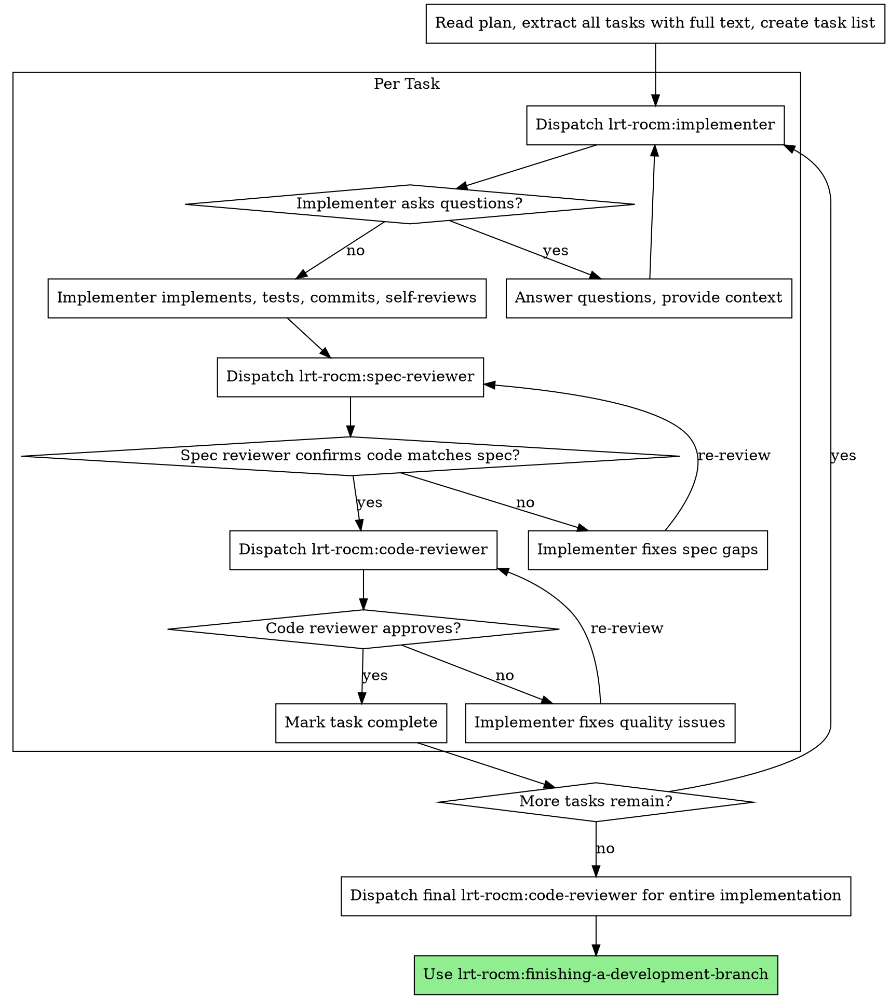

# Subagent-Driven Development

Execute plan by dispatching registered agents per task, with two-stage review after each: spec compliance first, then code quality.

**Core principle:** Fresh agent per task + two-stage review (spec then quality) = high quality, fast iteration

## When to Use

- Have an implementation plan (from lrt-rocm:writing-plans)
- Tasks are mostly independent
- Agent tool is available

## Agents Used

| Agent | Purpose |
|---|---|
| `lrt-rocm:implementer` | Implements a single task — writes code, tests, commits, self-reviews |
| `lrt-rocm:spec-reviewer` | Verifies implementation matches spec (read-only, doesn't trust implementer's report) |
| `lrt-rocm:code-reviewer` | Reviews code quality, architecture, production readiness |

## The Process



## How to Dispatch Each Agent

### Implementer

```
Agent tool:
  subagent_type: "lrt-rocm:implementer"
  description: "Implement Task N: [task name]"
  prompt: |
    ## Task Description
    [FULL TEXT of task from plan — paste it, don't make agent read file]

    ## Context
    [Where this fits, dependencies, architectural context]

    Work from: [directory]
```

### Spec Reviewer

```
Agent tool:
  subagent_type: "lrt-rocm:spec-reviewer"
  description: "Review spec compliance for Task N"
  prompt: |
    ## What Was Requested
    [FULL TEXT of task requirements]

    ## What Implementer Claims They Built
    [From implementer's report]
```

### Code Reviewer

```
Agent tool:
  subagent_type: "lrt-rocm:code-reviewer"
  description: "Code quality review for Task N"
  prompt: |
    WHAT_WAS_IMPLEMENTED: [from implementer's report]
    PLAN_OR_REQUIREMENTS: Task N from [plan-file]
    BASE_SHA: [commit before task]
    HEAD_SHA: [current commit]
    DESCRIPTION: [task summary]

    Additional checks:
    - Does each file have one clear responsibility?
    - Is the implementation following the file structure from the plan?
    - Did this change create overly large files?
```

## Model Override

Agents default to opus. Override with the `model` parameter for cost savings:

- **Mechanical tasks** (isolated functions, clear specs, 1-2 files): `model: "haiku"`
- **Integration tasks** (multi-file coordination, pattern matching): `model: "sonnet"`
- **Architecture/design tasks**: default opus — don't override

## Handling Implementer Status

**DONE:** Proceed to spec compliance review.

**DONE_WITH_CONCERNS:** Read the concerns. If about correctness or scope, address before review. If observations (e.g., "this file is getting large"), note and proceed.

**NEEDS_CONTEXT:** Provide the missing context and re-dispatch.

**BLOCKED:** Assess the blocker:
1. Context problem → provide more context, re-dispatch
2. Needs more reasoning → re-dispatch without model override (uses opus)
3. Task too large → break into smaller pieces
4. Plan is wrong → escalate to human

**Never** ignore an escalation or force retry without changes.

## Red Flags

**Never:**
- Start implementation on main/master branch without explicit user consent
- Skip reviews (spec compliance OR code quality)
- Proceed with unfixed issues
- Dispatch multiple implementers in parallel (conflicts)
- Make agent read plan file (provide full text instead)
- Skip scene-setting context
- Accept "close enough" on spec compliance
- Skip review loops (issues found → fix → re-review)
- **Start code quality review before spec compliance is done** (wrong order)
- Move to next task while either review has open issues

**If reviewer finds issues:**
- Implementer fixes them
- Reviewer reviews again
- Repeat until approved

**If agent fails task:**
- Dispatch fix agent with specific instructions
- Don't fix manually (context pollution)

## Integration

**Required workflow skills:**
- **lrt-rocm:using-git-worktrees** - Set up isolated workspace before starting
- **lrt-rocm:writing-plans** - Creates the plan this skill executes
- **lrt-rocm:finishing-a-development-branch** - Complete development after all tasks
