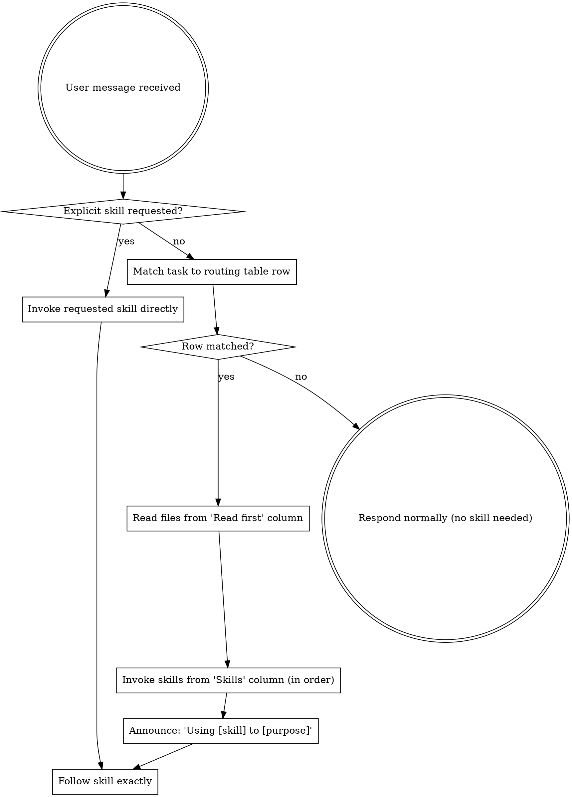

<SUBAGENT-STOP>
If you were dispatched as a subagent to execute a specific task, skip this skill.
</SUBAGENT-STOP>

## How It Works

The user's CLAUDE.md contains a **Task Routing** table that maps work areas to skills. When a user gives you a task:

1. **Match the task** to a row in the CLAUDE.md routing table
2. **Read** the files listed in the "Read first" column
3. **Invoke** the skills listed in the "Skills" column (in order if chained with ->)
4. **Skip** the files listed in the "Skip" column to save tokens

If the user explicitly requests a skill by name (e.g., `/lrt-rocm:the-rock`), invoke it directly — no routing needed.

If no row matches, respond normally without invoking skills.

## Instruction Priority

1. **User's explicit instructions** (CLAUDE.md, direct requests) — highest priority
2. **LRT skills** — override default system behavior where they conflict
3. **Default system prompt** — lowest priority

## How to Access Skills

Use the `Skill` tool. When you invoke a skill, its content is loaded and presented to you — follow it directly. Never use the Read tool on skill files.

## Skill Types

**Rigid** (TDD, debugging, verification): Follow exactly. Don't adapt away discipline.

**Flexible** (patterns, workflows): Adapt principles to context.

The skill itself tells you which.
