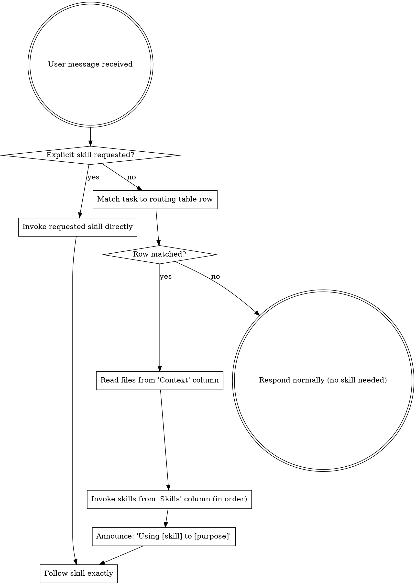

<SUBAGENT-STOP>
If you were dispatched as a subagent to execute a specific task, skip this skill.
</SUBAGENT-STOP>

## Task Routing

Match the user's task to a row and follow the route. Read the context files, then invoke the skills in order.

| Work area | Context (read first) | Skills | Skip |
|---|---|---|---|
| **Building TheRock** | `directory-map.md`, `docs/workflows/building.md` (plugin) | `lrt-rocm:the-rock` | tasks/, design docs |
| **Building via rocm-systems** | `directory-map.md`, `docs/workflows/building.md` (plugin) | `lrt-rocm:hip-ocl-monorepo-build` | tasks/, design docs |
| **Building on Windows** | `directory-map.md`, `docs/workflows/building.md` (plugin) | `lrt-rocm:pal-rocr-windows-build` | tasks/, design docs |
| **Debugging test failures** | `docs/workflows/debugging.md` (plugin) | `lrt-rocm:systematic-debugging`, then `lrt-rocm:regression-bisect-hip-ocl` if regression | unrelated source trees |
| **Fixing a bug** | `docs/workflows/debugging.md` (plugin) | `lrt-rocm:systematic-debugging` -> `lrt-rocm:test-driven-development` | unrelated source trees |
| **Implementing a feature** | task file in `tasks/active/`, `docs/workflows/feature-development.md` (plugin) | `lrt-rocm:brainstorming` -> `lrt-rocm:writing-plans` -> `lrt-rocm:subagent-driven-development` | unrelated source trees |
| **Reviewing code** | `docs/workflows/review-and-pr.md` (plugin) | `lrt-rocm:stage-review` -> `lrt-rocm:process-review` | build output |
| **Preparing a PR** | `docs/workflows/review-and-pr.md` (plugin) | `lrt-rocm:prep-pr`, `lrt-rocm:squash-prep` | build output |
| **Build system changes** | `docs/adding-third-party-dep.md` (plugin), CMakeLists.txt | `lrt-rocm:the-rock` (for context) | test output |
| **Submodule coordination** | `directory-map.md`, `.gitmodules` | `rk.py` for topic/branch management | build output |

If the user explicitly requests a skill by name (e.g., `/lrt-rocm:the-rock`), invoke it directly — no routing needed.

If no row matches, respond normally without invoking skills.

## Instruction Priority

1. **User's explicit instructions** (CLAUDE.md, direct requests) — highest priority
2. **LRT skills** — override default system behavior where they conflict
3. **Default system prompt** — lowest priority

## How to Access Skills

Use the `Skill` tool. When you invoke a skill, its content is loaded and presented to you — follow it directly. Never use the Read tool on skill files.

## Skill Types

**Rigid** (TDD, debugging, verification): Follow exactly. Don't adapt away discipline.

**Flexible** (patterns, workflows): Adapt principles to context.

The skill itself tells you which.
